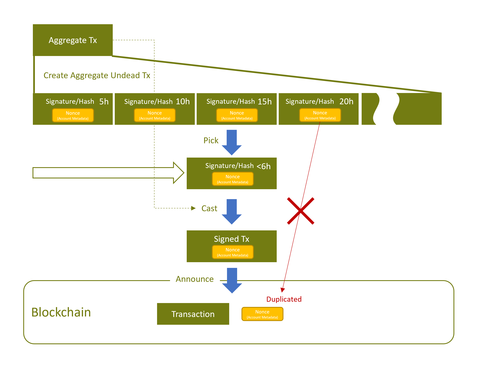

# Aggregate Undead Transaction for Symbol PoC

***・・・SymbolのDApps開発で使えるかもしれない秘術？・・・***

## 1. これは何ですか？

「Aggregate Undead Transaction（アグリゲートアンデッドトランザクション」とは、Symbol ブロックチェーンにおいて、
通常のトランザクションよりも長いライフタイムを持ったアグリゲートトランザクションのことです。

通常パブリックチェーンの設定であれば **6 時間** までの `Deadline` を指定可能で、
**アグリゲートボンなんとか**であっても、 最大 **48 時間** となっています。

`Deadline` は署名済トランザクションのライフタイムを表しており、
`Deadline` を過ぎた署名済トランザクションはブロックチェーンから受け入れを拒否され、文字通り死を迎えます。

当然のことながら、ネットワークプロパティの制限を超えて `Deadline` を指定しても、ブロックチェーンから受け入れを拒否されます。
長い Deadline を持つトランザクションは、`Deadline` までの時間が制限内に収まるまで待ってからアナウンスしなければなりません。

Aggregate Undead Transaction は、これらネットワークプロパティの制限を超えて自由に `Deadline` を指定し、
いつでもアナウンスできるようにした、言わば死を超越した「不死のトランザクション」です。

## 2. なぜこれが必要なのですか？

まず、前知識として署名済トランザクションの `Deadline` を後から変更することはできません。
`Deadline` を変えたいなら トランザクションの作成→署名をやり直す必要があります。当然、連署もすべてやり直しです。

また、アグリゲートコンプリートで作った署名済トランザクションは、ライフタイムが **最大 6 時間** と非常に短く、
オフチェーンでマルチシグトランザクションの連署を行う場合、時間的な問題が発生する可能性があります。

具体的に、この間リリースした [Metal on Symbol](https://github.com/OPENSPHERE-Inc/metal-on-symbol) の「Reinforce」では、
短い時間（実際にはマージンを取って 5 時間に設定しています）で連署を回す必要がありました。
Discord や Slack 等のチャットツールを使って関係者間で回すとしても、時間的ハードルが結構高いのではないでしょうか。

更に分散型のマーケットプレイスの場合を考えてみると、
「オファー」と「約定」を「マルチシグ転送トランザクション」と「その連署」で実装するような場合に、6 時間を超えて期限を設定したいでしょう。

**`Deadline` 自体は何時間にでも設定可能** ですが、 6 時間を超えて指定したとしても直ぐにはブロックチェーンが受け付けてくれず、
結局のところ約定が **`Deadline` の 6 時間前から** しか可能になりません。

つまり、Aggregate Undead Transaction を用いて、長いライフタイムのトランザクションを作成し、これらの問題を解決します。

ついでに、**アグリゲートボンなんとか** に唯一残されていた「長いライフタイム」という有意性を無力化し、**事実上の産廃** にします。

> 開発の目的としては [Smart Transaction](https://github.com/OPENSPHERE-Inc/smart-transaction-poc) での使用を想定しています。

## 3. 実証コードの実行方法

実証のサンプルコードを用意しました。
シンプルな転送を行うだけのトランザクションをアンデッド化します。

例によって [Node.js](https://nodejs.org/ja/) の環境がインストールされていることを前提とします。

### 1) リポジトリの取得

```shell
git clone --recursive git@github.com:OPENSPHERE-Inc/aggregate-undead-poc.git
cd aggregate-undead-poc
```

※サブモジュールが含まれるので `--recursive` を必ずつける事

### 2) ビルド

```shell
cd symbol-service
yarn        # or "npm install"
yarn build  # or "npm run build"

cd ..
yarn        # or "npm install"
yarn build  # or "npm run build"
```

### 3) 実行

予め環境変数 `NODE_URL` に、使用するノードの URL をセットしてください。

**Windows**

```shell
set NODE_URL=https://example.jp:3001
```

**Unix-like**

```shell
export NODE_URL=https://example.jp:3001
```

#### 転送トランザクションをアンデッド化

```shell
node dist/samples/create.js
```

上記を実行すると

1. プライベートキー（= 転送元アカウント）
2. 転送先アカウントアドレス
3. 転送量（XYM）
4. 期限（日で指定。1 日以上・最大 30 日）
5. メッセージ（省略可）
6. マルチシグの場合、連署するアカウントのプライベートキーを入力可能（省略可。複数可で、空 Enter すれば入力終了）

の入力が求められますので、入力してください。期限は技術的に何日でも行けますが、ここでは 30 日を最大にしています。

カレントディレクトに `undead.json` **アンデッドジェイソン** というファイルが作成されます。

上記ファイルが拡大された `Deadline` でアンデッド化された署名済みの転送トランザクションになります。

#### アンデッド化された署名済トランザクションをアナウンス

```shell
node dist/samples/cast.js undead.json
```

先ほどの `undead.json` を呼び出してアナウンスしましょう。設定した期限内ならいつでも構いません。

マルチシグの場合、連署するアカウントのプライベートキーを入力可能です。
不要の場合は Enter でスキップしてください。

最後にアナウンスしていいか確認プロンプトが表示されます。

## 4. コード解説

本コードでは任意のトランザクションを `NecromancyService` クラスでアンデッド化します。

### 1) コンストラクターで初期化

※[common.ts](./src/samples/common.ts) を参照

```typescript
import {SymbolService, NecromancyService } from "./services";
// SymbolService を初期化
const symbolService = new SymbolService({node_url: "https://example.jp:3001"});
// NecromancyService を初期化
const necromancyService = new NecromancyService(symbolService);
```

`node_url` には使用するノードの URL をセットしてください。

### 2) トランザクションをアンデッド化

※[create.ts](./src/samples/create.ts) を参照

```typescript
const undeadTx = await necromancyService.createTx(
    deadlineHours,
    innerTxs,
    signerAccount,
    cosignerAccounts,
    feeRatio,
    requiredCosigners,
);
```

**引数**

- `deadlineHours: number` - 期限を「時間」で指定。ネットワークプロパティの制限に関係なく指定可能
- `innerTxs: InnerTransaction[]` - アンデッド化したいトランザクション（作成時に `toAggregate` でアグリゲート化する事）
- `signerAccount: Account` - トランザクションに署名するアカウント
- `cosignerAccounts: Account[]` - (Optional)トランザクションに連署するアカウント
- `feeRatio: number` - (Optional)手数料率 0.0～1.0。デフォルト 0.0
- `requiredCosigners: number` - (Optional)アグリゲートトランザクション実行に要する連署の数。妥当な手数料の算出に使用（適当でも動作はする）

**戻り値**

- `AggregateUndeadTransaction` - アンデッド化された署名済トランザクション

**アルゴリズム**



基本的には長い期限のトランザクションを時分割して扱います。

1. ランダムな `nonce` を生成し、`nonce` をキーとしたアカウントメタデータトランザクションを、元のトランザクションリストに混ぜ込みます。
   > Aggregate Undead Transaction が一度でも実行されると、次回からメタデータ作成が失敗するので、
   > 時分割されたトランザクションの重複実行を防止できます。
2. 指定された期限までの期間を **5 時間** ずつに時分割してトランザクションを作成し、
   `signerAccount` と `cosignerAccounts` のプライベートキーで全てに署名・連署し、シグネチャーとトランザクションハッシュを得ます。
3. 先頭の `AggregateTransaction` 1つと、時分割された全トランザクションのシグネチャーとトランザクションハッシュを保存します。


### 3) JSONファイルへの書き出し

```typescript
const filePath = "./undead.json";
fs.writeFileSync(filePath, JSON.stringify(undeadTx.toJSON()), "utf-8");
```

`undeadTx.toJSON()` がプレーンなオブジェクトに変換します。

> `Deadlne` までの期間が長いほど JSON ファイルのサイズも大きくなります。

### 4) JSONファイルからの読み出し

※[cast.ts](./src/samples/cast.ts) を参照

```typescript
const undeadTx = AggregateUndeadTransaction.createFromJSON(JSON.parse(fs.readFileSync(filePath, "utf-8")));
```

### 5) アンデッド化された署名済トランザクションからアナウンス可能な署名済トランザクション取り出し

```typescript
const { signedTx, signature } = await necromancyService.pickTx(
    undeadTx, 
    cosignerAccounts
);
```

**引数**

- `undeadTx: AggregateUndeadTransaction` - アンデッド化された署名済トランザクション
- `cosignerAccounts: Account[]` - (Optional)トランザクションに連署するアカウント

**戻り値**

- `signedTx: SignedTransaction | undefined` - アナウンス可能な署名済トランザクション。エラーなら `undefined` が返る
- `signature: UndeadSignature | undefined` - 選択された署名。エラーなら `undefined` が返る

**アルゴリズム**


1. `AggregateUndeadTransaction` に格納された時分割されたシグネチャーリストの先頭から `Deadline` を走査して行き、
   現時刻でアナウンス可能なトランザクションのシグネチャーとハッシュを得る。走査の際、実際の `Deadline` からマイナス 1 時間のマージンを持たせる。
   > つまり、得られたトランザクションの `Deadline` は最短でも 1 時間の猶予が出来る。
   > また、時分割は 5 時間間隔なので、ネットワークの制限である 6 時間を超えることもない。
2. 適切なトランザクションが見つからず最後まで走査しきってしまったら、とりあえず最後のシグネチャーとハッシュを返す。
3. （`cosignerAccounts` が指定されているなら）トランザクションハッシュに連署する。
4. 走査によって得られたシグネチャーと、連署、`AggregateUndeadTransaction` に保存された1つの `AggregateTransaction` から
   `SignedTransaction` を作成して返す。

### 6) トランザクションをアナウンス

```typescript
await symbolService.announceTxWithCosignatures(signedTx, []);
const { networkType } = await symbolService.getNetwork();
const signerPubAccount = PublicAccount.createFromPublicKey(signedTx.signerPublicKey, networkType);
const result = (await symbolService.waitTxsFor(signerPubAccount, signedTx.hash, "confirmed")).shift();
```

Symbol SDK を使って普通にアナウンスし、承認されるまでウェイトしています。
エラーがあれば `result.error` にメッセージが返されます。

尚、トランザクション手数料は、アンデッド化時に署名したアカウント `signerAccount` から支払われます。

## 5. 副産物

今回、トランザクションにアカウントメタデータトランザクションを混ぜ込むことで、重複実行を防止する排他処理を実装しました。

この技法の副産物として、アンデッド化した署名済トランザクションの無効化が行えます（アナウンス前に限る）

方法としては、`createTx` では独自の `nonce` を渡せるので、
アンデッド化に保存した `nonce` を使用し、
トランザクションを無効化する場合は保存された `nonce` をキーとしたアカウントメタデータを作成してください。

一旦アカウントメタデータが作成されると、アンデッド化した署名済トランザクションをアナウンスしても必ず失敗します。

---

以上、何か質問等ありましたら Discussion へ、不具合等は Issue へお寄せいただければと思います。

本リポジトリは MIT ライセンスといたします。
